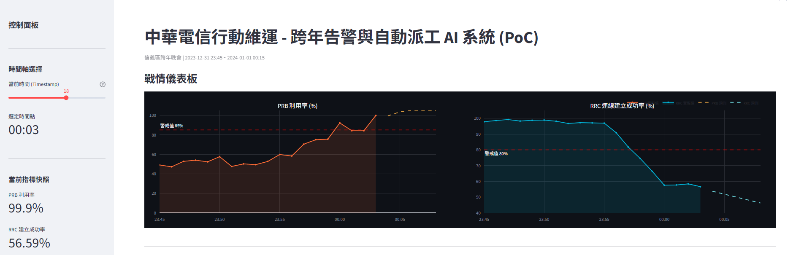
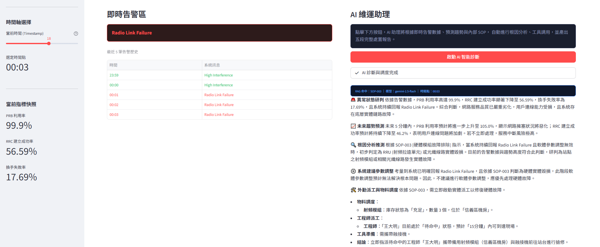

# 中華電信行動維運 AI 系統 (PoC)

> 以 LLM + RAG + Agentic Tool Use 實作的電信網路智能維運示範專案

---

## 系統截圖

### 戰情儀表板 — 即時 KPI 監控與預測趨勢


### AI 維運助理 — 自動根因分析與派工報告


---

## 專案簡介

本系統模擬中華電信跨年晚會（2023-12-31 23:45 ～ 2024-01-01 00:15）期間，信義區基地台面臨大量用戶湧入時的網路維運情境。系統整合多項 AI 技術，自動完成從「告警偵測」到「工程師派工」的完整處置流程。

---

## 技術架構

| 層次 | 技術 |
|---|---|
| 前端 UI | Streamlit |
| 大語言模型 | Google Gemini 2.5 Flash (`google-genai` SDK) |
| 知識檢索 (RAG) | ChromaDB + SentenceTransformers (`all-MiniLM-L6-v2`) |
| 預測分析 | NumPy `polyfit` 線性迴歸 |
| 資料視覺化 | Plotly |
| 環境管理 | python-dotenv |

---

## 核心功能

### 1. 即時 KPI 監控
- 以時間軸滑桿模擬不同時間點的網路狀態
- 即時顯示 PRB 利用率、RRC 建立成功率、換手失敗率
- 警戒值紅線標示（PRB > 85%、RRC < 80%）

### 2. 預測性維運
- 以最近 5 筆歷史數據進行線性迴歸，預測未來 5 分鐘趨勢
- 圖表以虛線延伸呈現預測走勢，提早掌握惡化方向

### 3. RAG 知識庫檢索
- 內建三份標準作業程序（SOP）：
  - SOP-001：細胞壅塞處理
  - SOP-002：連線建立失效處理
  - SOP-003：硬體模組故障排除
- 依當前告警狀態自動語意搜尋最相關 SOP

### 4. Agentic Tool Use（Function Calling）
AI 判斷為硬體故障時，自動依序呼叫外部工具：
1. `check_inventory` — 查詢零件庫存與位置
2. `check_engineer_schedule` — 確認外勤工程師排班與 ETA

UI 以 `st.status` 狀態框即時呈現工具執行進度。

### 5. 五段式 AI 診斷報告
整合告警數據、預測趨勢、SOP 與工具查詢結果，自動產出：
- 異常狀態研判
- 未來趨勢預測
- 根因分析推測
- 系統建議參數調整
- 外勤派工與物料調度

---

## 快速啟動

### 環境需求
- Python 3.10+

### 安裝依賴

```bash
pip install streamlit google-genai chromadb sentence-transformers numpy pandas plotly python-dotenv
```

### 設定 API 金鑰

建立 `.env` 檔案：

```
GEMINI_API_KEY=your_api_key_here
```

> API 金鑰請至 [Google AI Studio](https://aistudio.google.com/) 取得。

### 初始化知識庫

```bash
python setup_rag.py
```

### 啟動應用程式

```bash
streamlit run app.py
```

---

## 專案結構

```
.
├── app.py                  # 主應用程式（Streamlit UI + AI 邏輯）
├── setup_rag.py            # ChromaDB 知識庫建置與 SOP 寫入
├── generate_mock_data.py   # 模擬網路 KPI 數據產生器
├── network_mock_data.csv   # 模擬數據（31 筆，涵蓋跨年時段）
├── chroma_db/              # ChromaDB 向量資料庫（本地持久化）
├── screenshots/            # 系統截圖
├── .env                    # API 金鑰（不納入版本控制）
└── .gitignore
```

---

## 注意事項

- `.env` 已列入 `.gitignore`，請勿將 API 金鑰上傳至公開儲存庫
- 首次執行前須先執行 `python setup_rag.py` 建立向量資料庫
- Embedding 模型 `all-MiniLM-L6-v2` 首次載入時需下載（約 80MB）
